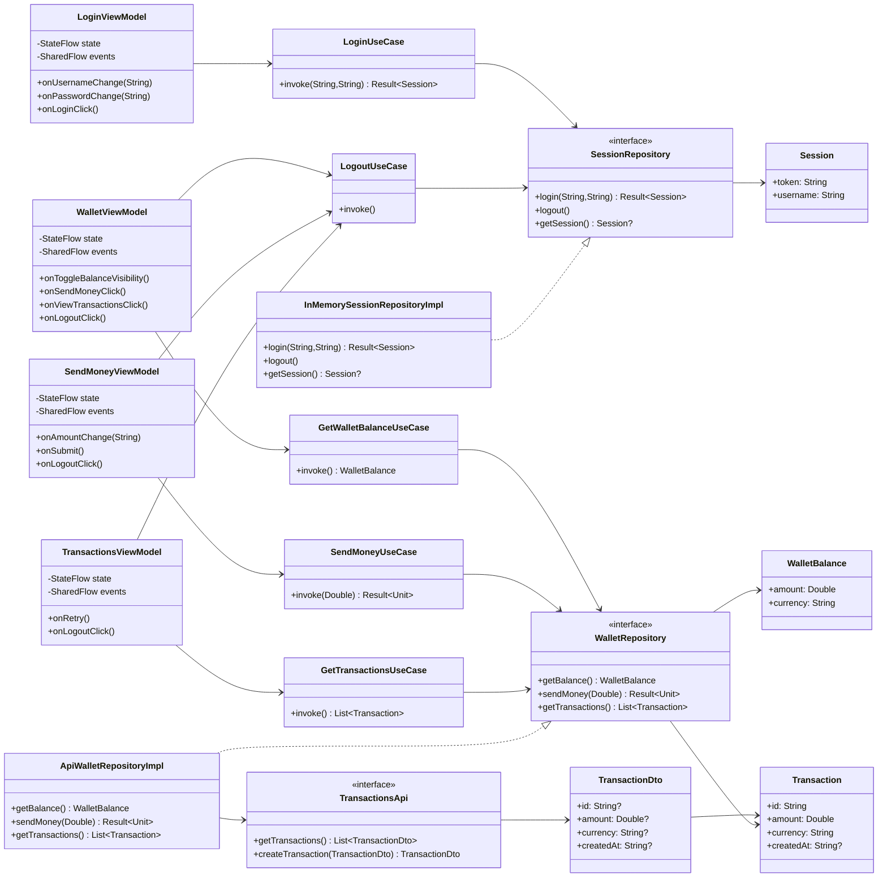
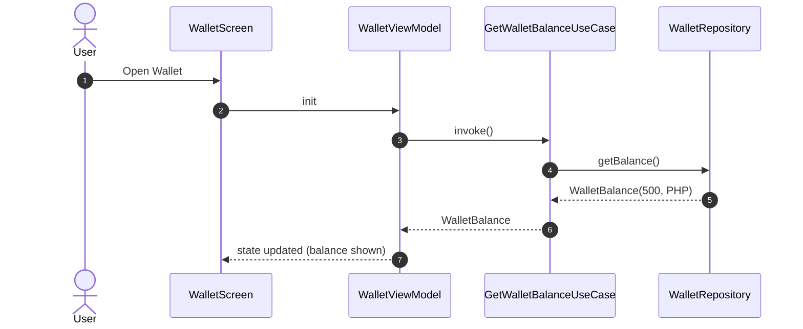
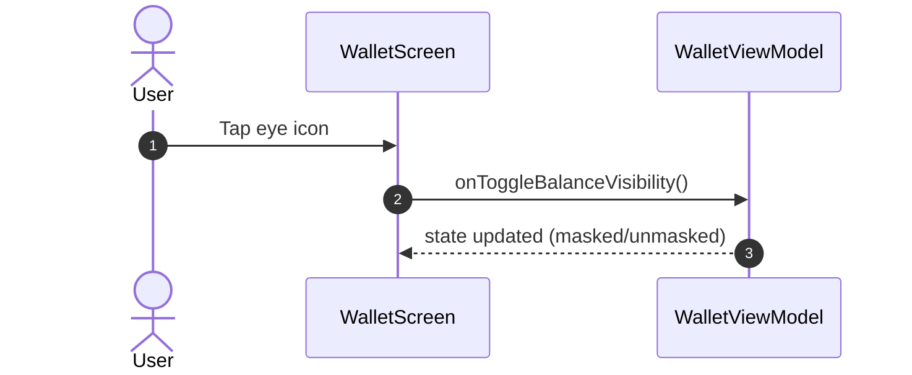
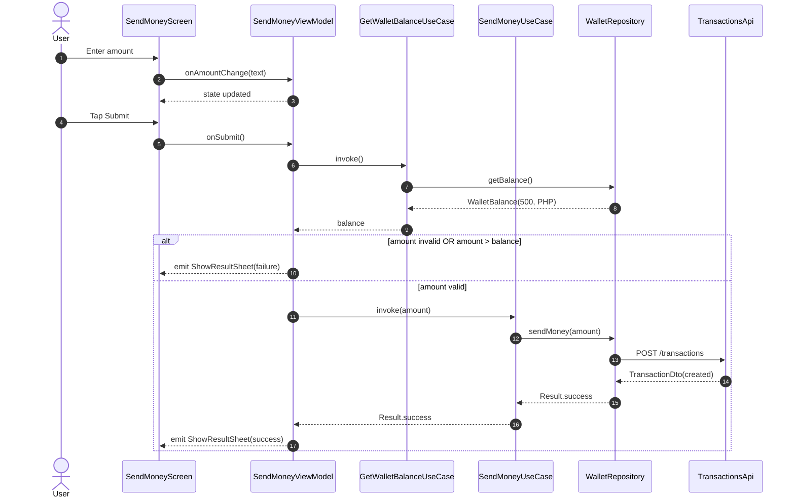
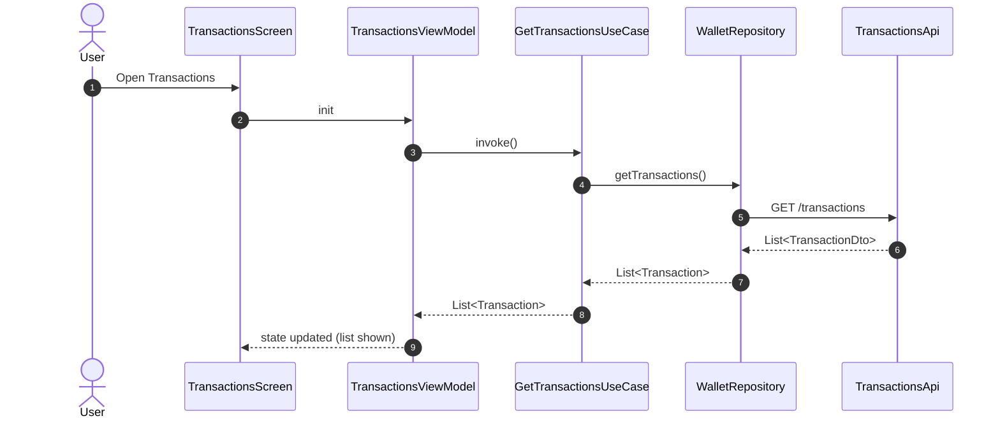
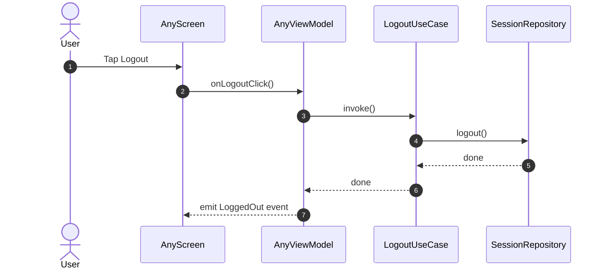

# Design Documentation

This document provides a **Class Diagram** and **Sequence Diagrams** for the Maya Wallet Demo app.

> Diagram format: **Mermaid**.

---

## Class Diagram

---

## Sequence Diagrams

### 1) App Start → Wallet loads balance

---

### 2) Wallet → Toggle balance visibility

---

### 3) Send Money → Validate and POST transaction (Mock API)

---

### 4) Transactions → GET list and render

---

### 5) Logout (any screen)

---

## Notes / Assumptions

- **Wallet balance is fixed at 500 PHP** as per exam requirement.
- **Transactions** are stored via a mock REST API (e.g., MockAPI.io) using `POST /transactions` and retrieved using `GET /transactions`.
- ViewModels expose:
  - `StateFlow<UiState>` for UI rendering
  - `SharedFlow<Event>` for one-off navigation / bottom sheets.
